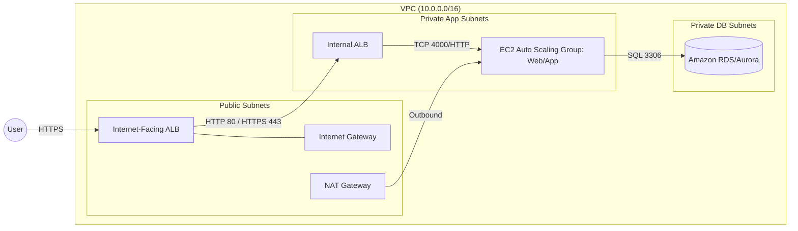
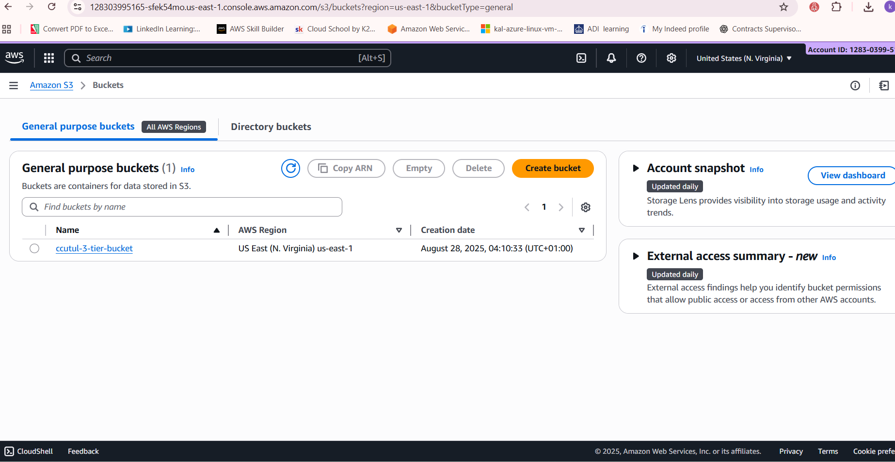
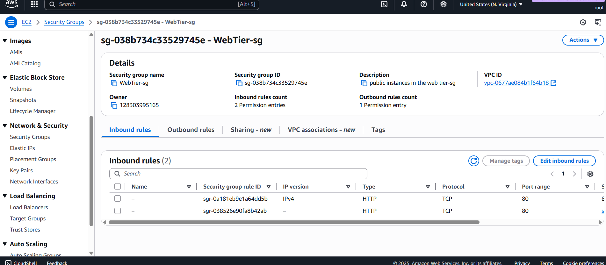
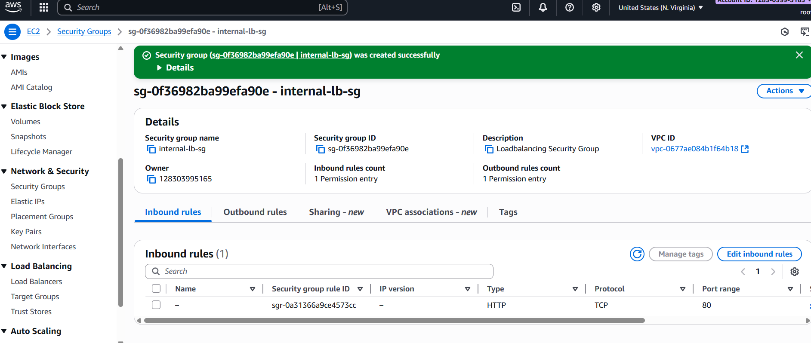
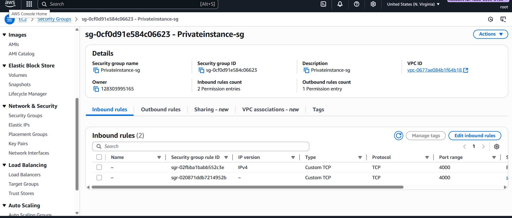
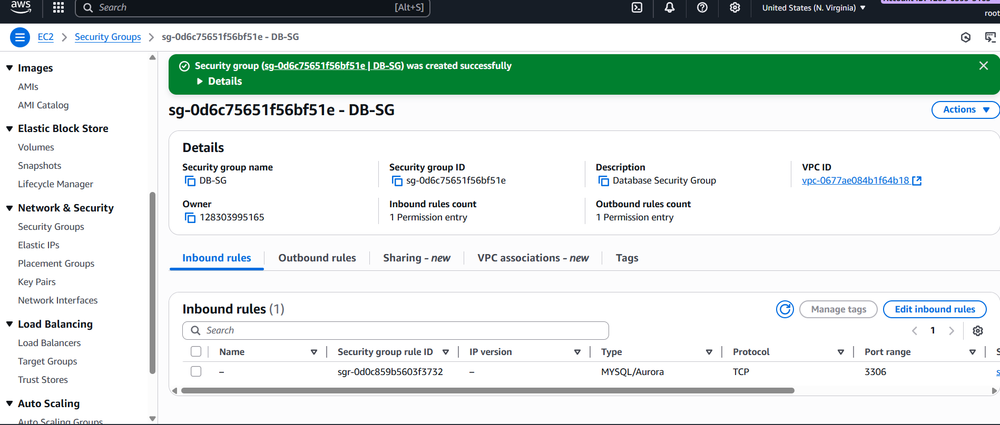
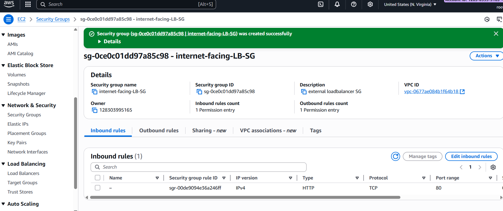
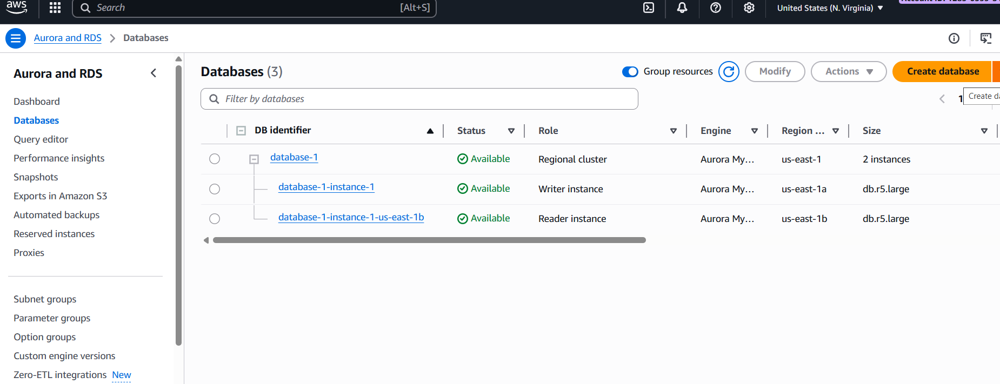
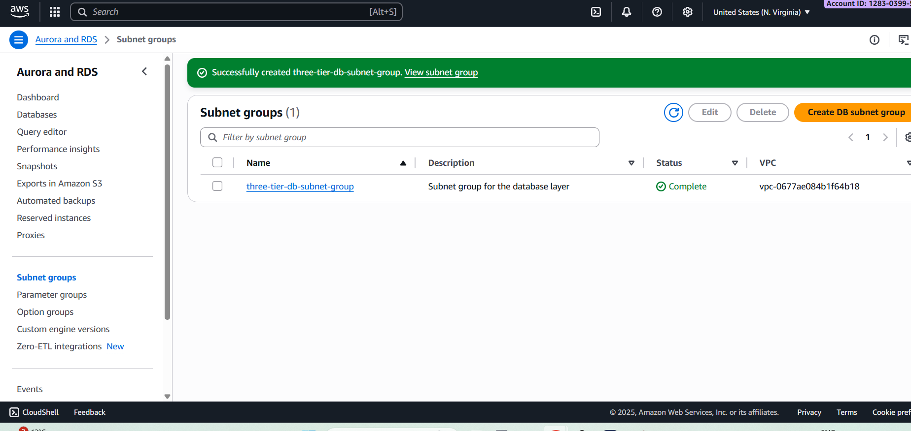

# AWS 3‑Tier Web Architecture

[](https://aws.amazon.com/)
[](#architecture)
[](LICENSE)
[](CONTRIBUTING.md)

A production‑style **three‑tier web application** on AWS with **internet‑facing** and **internal** load balancing, **auto‑scaling app tier**, and a managed **RDS/Aurora database** isolated in private subnets. This repository packages my end‑to‑end notes, screenshots, and a clean reference **architecture diagram** for quick learning and reuse.

> 👋 First real‑world project in my portfolio — cleaned up for GitHub and LinkedIn. Feedback welcome!

## TL;DR
- Public ALB → Internal ALB → EC2 Auto Scaling Group (web/app)
- Private DB subnets for Amazon RDS/Aurora
- VPC with public, private‑app, and private‑db subnets across 2 AZs
- Tight Security Groups and least‑privilege IAM for EC2
- NAT Gateway for outbound from private app tier

## Architecture


### High‑Level Design
- **VPC & Subnets:** 2× public, 2× private‑app, 2× private‑db (multi‑AZ).
- **Routing:** IGW for public access; NAT for private outbound; dedicated route tables.
- **Load Balancing:** Internet‑facing ALB (HTTPS) → Internal ALB (HTTP/HTTPS).
- **Compute:** EC2 Auto Scaling Group for web/app tier (port 4000 example).
- **Database:** Amazon RDS/Aurora in private DB subnets (port 3306).
- **Security:** Segregated SGs per tier; principle of least privilege for IAM.
- **Observability:** ALB target health, instance logs (PM2 example), and screenshots.

## Repository Layout
```
AWS-3-Tier-Web-Architecture/
├─ docs/                    # Diagrams, notes
├─ screenshots/             # Build walkthrough evidence
├─ LICENSE
├─ .gitignore
└─ README.md
```

## Getting Started
> If you're following along in the AWS Console, use these as your **implementation cues** and cross‑check with the screenshots.

1. **VPC & Subnets**
   - Create VPC (e.g., 10.0.0.0/16).
   - Add **6 subnets** across 2 AZs: 2× public, 2× private‑app, 2× private‑db.
   - Associate appropriate **route tables** (public with IGW; private‑app with NAT; private‑db no internet).

2. **Security Groups**
   - `web-tier-sg`: Inbound 80/443 from Internet; to internal ALB.
   - `internal-lb-sg`: Inbound 80/443 from `web-tier-sg`; to app instances.
   - `privateinstance-sg`: Inbound app port (e.g., 4000) from `internal-lb-sg`; outbound 3306 to `db-sg`.
   - `db-sg`: Inbound 3306 from `privateinstance-sg` only.

3. **Load Balancers**
   - **Public ALB** (HTTPS) → target group: **Internal ALB**.
   - **Internal ALB** → target group: **EC2 ASG**.

4. **Compute (App Tier)**
   - Launch template with user data to install/runtime (Node/PM2 or your stack).
   - Auto Scaling Group across the two private‑app subnets.
   - Health checks via target groups.

5. **Database**
   - Create **DB Subnet Group** with the two private‑db subnets.
   - Launch **Amazon RDS/Aurora** (MySQL‑compatible shown in screenshots).
   - Security: only reachable from `privateinstance-sg`.

6. **S3 (Optional)**
   - Use an S3 bucket for assets/backups as needed (screenshots show bucket setup).

7. **Validation**
   - Test app health at the internal ALB.
   - Confirm public access via internet‑facing ALB (HTTPS).
   - Verify DB connectivity from app tier only.

## Screenshots
Below is a curated sample; see the **screenshots/** folder for the full set.









## How to Reuse
- Fork this repo and adapt ports, SG names, and AMI/user‑data to your stack.
- Convert to **Infrastructure as Code** (Terraform/CloudFormation) for repeatability.
- Add TLS certificates to the public ALB (ACM) and set up a friendly domain (Route 53).

## Roadmap
- [ ] Terraform module version
- [ ] GitHub Actions CI to validate Terraform
- [ ] SSM Parameter Store for config
- [ ] ALB access logs to S3 + Athena
- [ ] CloudWatch dashboards/alarms

## Credits
Original workshop reference for baseline topology:  
- aws-samples/**aws-three-tier-web-architecture-workshop** (used as a learning guide).

## Author
**Kallol K. Das** — Cloud / Solutions Architect (AWS)  
LinkedIn: https://www.linkedin.com/in/kallol-k-das/

## License
This project is licensed under the **MIT License** - see [LICENSE](LICENSE).
